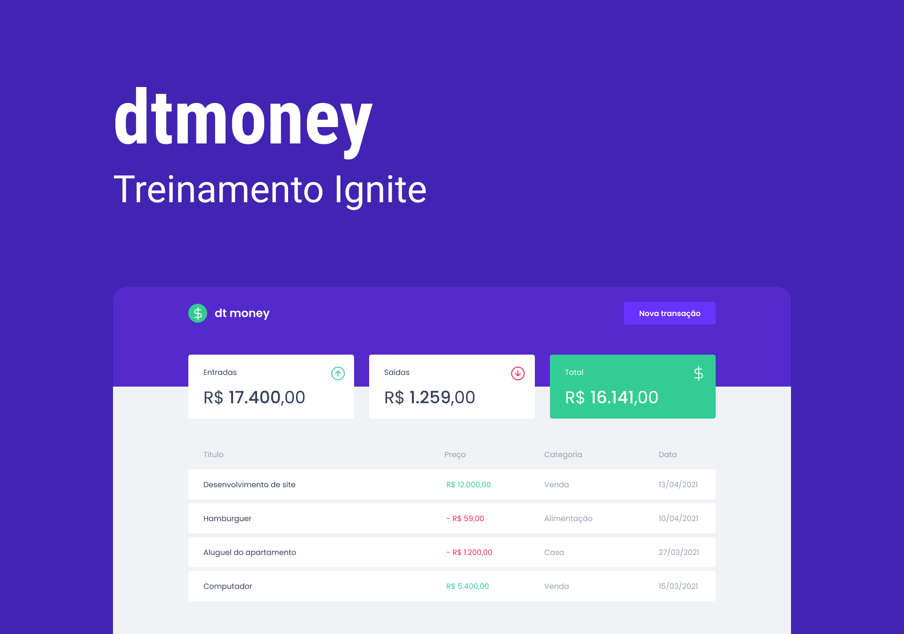
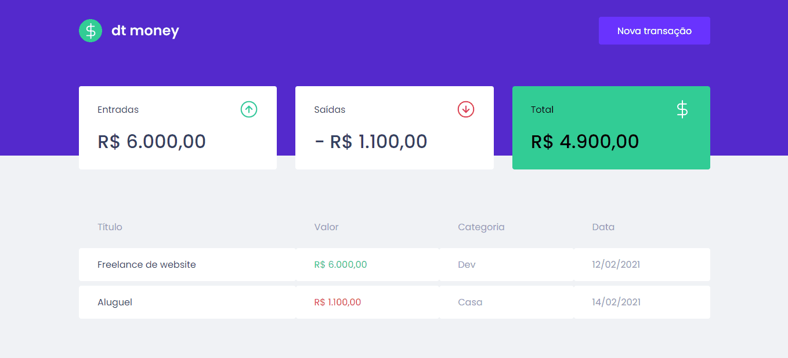

<section align="center">
    
</section>

<h2 align="center">Summary</h2>

<p align="center">
    <a href="#about">📙 About</a>
    <a href="#preview">🖼️ Preview</a>
    <a href="#start">📖 How to Start</a>
    <a href="#technologies">💻 Technologies</a>
</p>

<h4 align="center">
   ✔️ dtmoney project finished ✔️
</h4>

<H2 id="about">📙 About</H2>

<p>Developed mostly using React and Typescript, dtmoney is a basic application used for financial management. It has a input for new transactions including deposits and withdraws. It also shows all your account movements and the balance on the main screen.</p>
<and>Originally created on Ignite from <a href="https://www.rocketseat.com.br/">Rocketseat</a> and made by <a href="https://www.linkedin.com/in/kleverson-kenji-iwatani/">Kenji Iwatani</a></p>

<!-- <p>
    <h3><a href="https://letmeask-c10c3.web.app/">Check website &rarr;</a></h3>
</p> -->

---

<H2 id="preview">🖼️ Preview</H2>

<section align="center">
    
</section>

---

<H2 id="start">📖 How to Start</H2>

```bash
# Clone this repository
$ git clone https://github.com/iwataniKenji/dtmoney.git

# Access the project directory
$ cd dtmoney

# Download dependencies
$ yarn

# Run application
$ yarn start
```

<H2 id="technologies">💻 Technologies</H2>

- [x] <a href="https://create-react-app.dev/">Create React-App</a>
- [x] <a href="https://www.typescriptlang.org/">Typescript</a>
- [x] <a href="https://styled-components.com/">Styled Components</a>
- [x] <a href="https://miragejs.com/">Miragejs</a>
- [x] <a href="https://polished.js.org/">Polished</a>
